# Dynamic Football Simulator

A Java-based football simulation project featuring dynamic team rating and match systems, 
league and World Cup simulations, persistent saves, and automated unit testing.


## Overview

Dynamic Football Simulator is a Java-based football simulation project
developed as a self-directed learning project.

The project began as a simple football simulator and has since been
progressively refactored into a more structured object-oriented application.

The simulator currently supports league and World Cup competitions,
a complex team rating system, a stochastic match model along with match prediction, 
promotion and relegation, persistent save data, and automated unit testing.

## Features

- Object-oriented Java architecture
- Dynamic Rating Equation (DRE)
- Dynamic Uncertainty Match Model (DUMM)
- Match predictor with win, draw, lose chance percentage
- League simulation with promotion and relegation
- World Cup simulation
- Ability to simulate instantly or one match at a time using a settings mode
- Match simulation with extra time and penalties
- Team form and historical statistics
- JSON-based persistence
- Save, load and delete simulations
- Team and competition data loaded from JSON
- JUnit 5 unit testing
- Console-based user interface

## How It Works

The simulator follows a structured football simulation cycle depending on simulation type.
In league modeTeams are created or loaded, organised into either leagues or tournament groups,
and then progress through matches and seasons using a complex stochastic match model and team rating system.
Match results update team statistics and ratings,
while league and tournament results determine promotion, relegation,
qualification, and progression through knockout stages.

When the simulator starts, the user selects one of two simulation modes:

* **League Mode** — a season-based league system consisting of 30 teams with promotion and relegation.
* **World Cup Mode** — a huge tournament consisting of 100 teams with qualification, group stages and knockout rounds.

### Simulation Flow

1. **Select Simulation Mode:**
   The user chooses between League Mode and World Cup Mode.

2. **Load or Start a Simulation:**
   The user can load an existing save, delete a save, or start a new simulation.

3. **Choose Simulation Settings:**
   The user can choose whether to simulate entire seasons at once or progress through matches one game at a time.

4. **Create or Load Teams**
   Teams are either created from the default data or loaded from an existing save. If required, teams first compete in a qualification league before entering the main competition.

5. **Competition Setup:**
   Teams are organised into leagues in League Mode or tournament groups in World Cup Mode.

6. **Match and Season Progression:**
   Matches are simulated throughout the competition. Match results update team statistics and ratings, which in return affect their match probability, while the competition structure determines how teams progress.

7. **League and Tournament Outcomes:**
   In League Mode, results determine promotion and relegation between league tiers. In World Cup Mode, teams progress through the group stage and into the knockout rounds.

8. **World Cup Rating Lock:**
   In World Cup Mode, team ratings are finalised after the qualification stage and remain fixed for the group stage and knockout rounds.

9. **Save and Continue:**
   The current simulation can be saved and continued at a later time.

## Dynamic Rating Equation (DRE)

The **Dynamic Rating Equation (DRE)** is the system used to calculate and update team ratings throughout the simulation. 
It is designed to make team strength change dynamically based on performance rather than remaining fixed. 
This system is implemented in the `DynamicRatingEquation` service and is used by the match simulation and team management systems.

Mathematical formula:

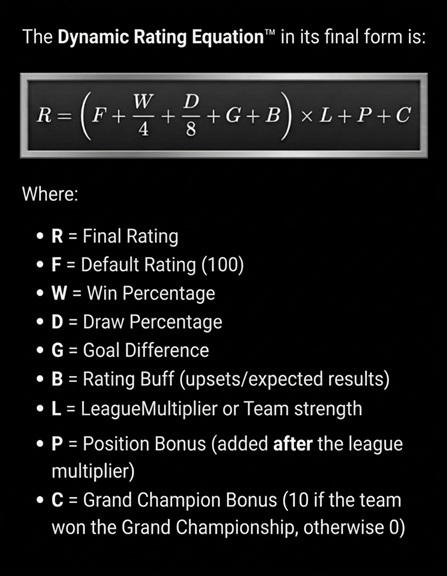

Code snippet from `DynamicRatingEquation` class:

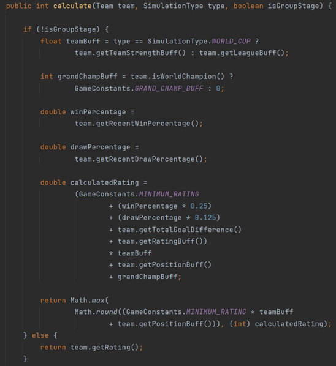

The rating calculation considers several factors, including:

* **Default team rating (100)**
* **Win percentage**
* **Draw percentage**
* **Recent form**
* **League position**
* **Previous rating adjustments**
* **Grand Champion status**
* **Competition-specific modifiers**

The DRE combines these factors to calculate a team's effective rating before matches are simulated.
This allows successful teams to gradually become stronger while teams performing poorly can lose rating over time.

### Dynamic Rating Updates

After each match, the result is used to update the team's statistics and rating adjustment.
Strong performances can increase a team's rating, while poor performances can reduce it.

The system also accounts for the difference in strength between teams.
A result against a significantly stronger opponent can therefore have a different impact from a result against a similarly rated or weaker opponent.

This creates a continuously changing competitive environment where team strength develops throughout a simulation rather than being permanently determined at the beginning.

### Design Goal

The main goal of the DRE is to provide **dynamic and performance-driven team ratings** while allowing long-term team progression across multiple seasons.

## Dynamic Uncertainty Match Model (DUMM)

The **Dynamic Uncertainty Match Model (DUMM)** is responsible for determining match outcomes based on the relative strength of the teams involved.

Rather than making the higher-rated team automatically win, DUMM introduces controlled uncertainty into each match.
This allows weaker teams to occasionally defeat stronger opponents while still making team ratings meaningful over a large number of matches.

Mathematical structure:

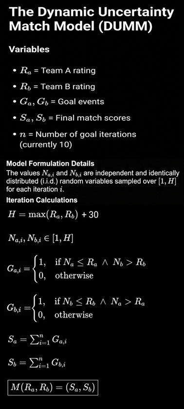

Code snippet from `Match` class:

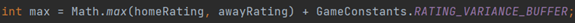

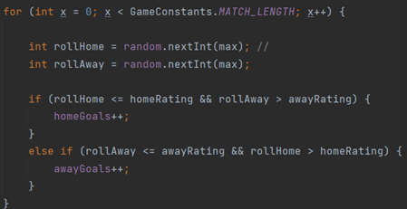

The model considers factors including:

* **Home and away team ratings**
* **Rating difference between the teams**
* **Random variation**
* **Match uncertainty**
* **Competition-specific conditions**

The rating difference influences the probability of each team winning, drawing, or losing. 
A larger difference in rating generally gives the stronger team a higher probability of winning, 
while a smaller difference produces a more balanced match.

Random variation prevents the simulator from becoming completely predictable. 
This creates realistic variation across individual matches while allowing stronger teams to demonstrate their advantage over the course of a season or tournament.

### Purpose

The main purpose of DUMM is to balance **predictability and uncertainty**.

A team's rating should have a meaningful influence on its results, but individual matches should not be completely predetermined.
This allows unexpected results and underdog victories while maintaining realistic long-term performance.

DUMM is used by the match simulation system to generate outcomes throughout both League Mode and World Cup Mode.

### DRE & DUMM Interaction

DRE and DUMM are designed to work together as a continuous feedback loop rather than as two independent systems.

The team's rating, calculated by the **Dynamic Rating Equation (DRE)**,
is used by the **Dynamic Uncertainty Match Model (DUMM)** to determine the probabilities of different match outcomes.

Once the match is simulated, the result is fed back into the team's statistics and rating adjustment.
The DRE then uses this updated performance data when calculating the team's future rating.

The process can be summarised as:

**Team Performance → DRE → Team Rating → DUMM → Match Outcome → Updated Performance → DRE**

This creates a feedback loop where:

* A team performing well can increase its rating.
* A higher rating gives the team a greater probability of positive results against weaker opponents.
* Strong results continue to influence the team's future rating.
* Poor performances can reduce a team's rating over time.
* Even highly rated teams can still lose matches because DUMM introduces uncertainty.
* The changing ratings continually affect future match probabilities.

This interaction allows team strength to evolve throughout a simulation. Rather than assigning a fixed rating and using it for every match, the results of previous matches influence future match probabilities.

The combination of DRE and DUMM is therefore what creates the simulator's dynamic competitive environment: **team strength influences results, while results influence future team strength.**


### Match Prediction

DUMM is also used by the `MatchPredictor` class to provide an estimated probability of each possible match outcome before the match is simulated.

The predictor runs **1,000 simulated matches** using the same match outcome model and records how many times each team wins or the match ends in a draw. These results are then converted into approximate win and draw probabilities.

Console output example:

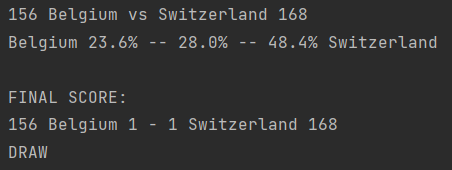

This gives the user an indication of how evenly matched the teams are before the actual match takes place, while still allowing the real match simulation to produce a different result.

## Simulation Modes

The simulator provides two distinct simulation modes, each with its own competition structure and progression system.

### League Mode

League Mode simulates a multi-tier domestic season system across multiple leagues.
If it's a new League mode, a qualification league happens to set up the leagues/groups

* Teams compete across different league tiers.
* Three leagues (Platinum, Diamond, Champion) consisting of ten teams.
* Each season consists of multiple match weeks.
* Team ratings dynamically change based on performance using the **Dynamic Rating Equation (DRE)**.
* League standings are updated as matches are played.
* Successful teams can be promoted to a higher tier.
* Teams finishing in relegation positions can move to a lower tier.
* Top-performing teams of the champion league can qualify for the Grand Championship knockouts.
* The simulation can be progressed one match at a time or an entire season can be simulated automatically.
* User gets a chance to quit or save after every season.

This mode is designed to demonstrate **long-term team progression and competition across multiple seasons**.

### World Cup Mode

World Cup Mode simulates an international tournament consisting of qualification, a group stage and knockout rounds.

* Teams first compete in a qualification stage (out of 100 teams).
* Qualified teams are placed into World Cup groups.
* Team ratings are finalised after qualification.
* Ratings remain fixed throughout the group stage and knockout rounds.
* Teams progress based on their tournament results.
* The group stage determines which teams advance to the knockout rounds.
* Knockout matches continue until a tournament winner is determined.
* Penalty shootouts are used when required to determine a winner.

Unlike League Mode, World Cup Mode does not continuously change team ratings once qualification has finished. This provides a consistent measure of team strength throughout the tournament.

### Mode Comparison

| Feature                   | League Mode                     | World Cup Mode                |
|---------------------------|---------------------------------|-------------------------------|
| Competition               | Multi-tier league system        | International tournament      |
| Qualification             | Quick qualification if required | Dedicated qualification stage |
| Ratings                   | Dynamically updated             | Fixed after qualification     |
| Group Stage               | No                              | Yes                           |
| Promotion / Relegation    | Yes                             | No                            |
| Knockout Stage            | Grand Championship              | World Cup knockout            |
| Multi-season progression  | Yes                             | No                            |
| Match-by-match simulation | Yes                             | Yes                           |
| Full-season simulation    | Yes                             | Yes                           |

## Project Architecture

```text    
    src/
├── Main/
│   ├── java/
│   │   ├── app/
│   │   │   ├── FootballSimulator
│   │   │   └── Main
│   │   ├── config/
│   │   │   └── GameConstants
│   │   ├── data/
│   │   │   ├── HallOfFame
│   │   │   ├── LeagueSaveData
│   │   │   ├── SaveGame
│   │   │   ├── SaveMapper
│   │   │   ├── TableLeagueSaveData
│   │   │   ├── TeamData
│   │   │   ├── TeamSaveData
│   │   │   └── WorldCupSaveData
│   │   ├── domain/
│   │   │   ├── dto/
│   │   │   │   ├── GrandChampionPodium
│   │   │   │   ├── GroupResult
│   │   │   │   ├── KnockoutResult
│   │   │   │   └── LeagueResult
│   │   │   ├── enums/
│   │   │   │   ├── KnockoutRound
│   │   │   │   ├── LeagueTier
│   │   │   │   ├── MatchOutcome
│   │   │   │   ├── MenuAction
│   │   │   │   └── SimulationType
│   │   │   └── model/
│   │   │       ├── KnockoutStage
│   │   │       ├── League
│   │   │       ├── Match
│   │   │       ├── MatchHistory
│   │   │       ├── PenaltyShootout
│   │   │       ├── Season
│   │   │       └── Team
│   │   ├── service/
│   │   │   ├── engine/
│   │   │   │   ├── DynamicRatingEquation
│   │   │   │   ├── MatchPredictor
│   │   │   │   └── TeamFactory
│   │   │   └── management/
│   │   │       ├── LeagueManager
│   │   │       └── MatchResult
│   │   ├── simulations/
│   │   │   ├── TableLeagueSimulator
│   │   │   └── WorldCupSimulator
│   │   └── ui/
│   │       ├── ConsolePrinter
│   │       ├── GameMenu
│   │       ├── GameSettings
│   │       └── Input
│   └── resources/
│       ├── data/
│       │   └── hall_of_fame.json
│       └── teams/
│           ├── default_league_teams.json
│           └── default_world_cup_teams.json
│
└── test/
    └── java/
        ├── app/
        │   └── FootballSimulatorTest
        ├── data/
        │   ├── HallOfFameTest
        │   ├── SaveGameTest
        │   └── SaveMapperTest
        ├── domain/
        │   ├── dto/
        │   │   ├── GroupResultTest
        │   │   └── LeagueResultTest
        │   ├── enums/
        │   │   └── KnockoutRoundTest
        │   └── model/
        │       ├── KnockoutStageTest
        │       ├── LeagueTest
        │       ├── MatchHistoryTest
        │       ├── MatchTest
        │       ├── PenaltyShootoutTest
        │       └── TeamTest
        └── service/
            ├── engine/
            │   ├── DynamicRatingEquationTest
            │   ├── MatchPredictorTest
            │   └── TeamFactoryTest
            └── management/
                ├── LeagueManagerTest
                └── MatchResultTest
```

## Technologies & Tools

The project is built using Java and a small set of supporting libraries and development tools.

### Core Technologies

* **Java 17** — Main programming language.
* **Gradle** — Build automation and dependency management.
* **ShadowJar** — Creates a standalone executable JAR containing the project and its dependencies.
* **Jackson Databind** — JSON serialisation and deserialisation for saved games and team data.
* **JUnit 5** — Unit testing framework.
* **Mockito** — Mocking dependencies during unit testing.

### Java Features & Data Structures

The project makes use of standard Java features and collections, including:

* **Object-Oriented Programming** — Classes, encapsulation, constructors and dependency injection.
* **Records** — Used for immutable DTOs and simulation results.
* **Lists / ArrayLists** — Used for collections of teams, results and other ordered data.
* **Arrays** — Used where fixed-size collections are appropriate.
* **Deque / ArrayDeque** — Used by `MatchHistory` to maintain recent match results.
* **Enums** — Used for fixed states such as simulation types, league tiers, match outcomes and knockout rounds.
* **Generics** — Used to provide type-safe reusable classes such as the save system.

### Development Practices

* **Unit Testing** — Automated tests using JUnit 5 and Mockito.
* **Javadoc Documentation** — Classes, constructors and public methods are documented to improve maintainability.
* **Separation of Responsibilities** — Domain models, services, simulations, data and user-interface components are separated into dedicated packages.
* **Dependency Injection** — Dependencies such as Random, ConsolePrinter and Input are provided to classes rather than being created internally where appropriate.

### Development Tools

* **IntelliJ IDEA** — Primary development environment.
* **Git & GitHub** — Version control and project hosting.

## Testing

The project uses **JUnit 5** for automated unit testing and **Mockito** where dependencies need to be isolated or controlled during tests.

Testing is organised to mirror the main source-code architecture, making individual components easier to test and maintain.

### Test Coverage

The test suite covers several areas of the application:

* **Domain Models** — Tests for teams, matches, leagues, match history, knockout stages and penalty shootouts.
* **DTOs & Results** — Tests for result objects such as `GroupResult` and `LeagueResult`.
* **Simulation Engines** — Tests for the Dynamic Rating Equation, Match Predictor and Team Factory.
* **League Management** — Tests for promotion, relegation and match-result processing.
* **Persistence** — Tests for saving, loading and mapping simulation data.
* **Application Behaviour** — Tests for important application-level functionality.

### Test Structure

The test directory follows the same package structure as the main source code:

```text
└── test/
    └── java/
        ├── app/
        │   └── FootballSimulatorTest
        ├── data/
        │   ├── HallOfFameTest
        │   ├── SaveGameTest
        │   └── SaveMapperTest
        ├── domain/
        │   ├── dto/
        │   │   ├── GroupResultTest
        │   │   └── LeagueResultTest
        │   ├── enums/
        │   │   └── KnockoutRoundTest
        │   └── model/
        │       ├── KnockoutStageTest
        │       ├── LeagueTest
        │       ├── MatchHistoryTest
        │       ├── MatchTest
        │       ├── PenaltyShootoutTest
        │       └── TeamTest
        └── service/
            ├── engine/
            │   ├── DynamicRatingEquationTest
            │   ├── MatchPredictorTest
            │   └── TeamFactoryTest
            └── management/
                ├── LeagueManagerTest
                └── MatchResultTest
```

This structure keeps tests closely associated with the components they verify and makes the test suite easier to navigate as the project grows.

### Example Tests

Some of the key areas tested include:

* `DynamicRatingEquationTest` — verifies the team's dynamic rating calculations.
* `MatchPredictorTest` — verifies match probability calculations.
* `MatchTest` — verifies match simulation behaviour and statistic updates.
* `MatchHistoryTest` — verifies recent-form history and calculations.
* `LeagueMangerTest` — verifies promotion and relegation logic.
* `PenaltyShootoutTest` — verifies that knockout matches produce a winner when required.
* `SaveGameTest` — verifies save and load behaviour.
* `SaveMapperTest` — verifies conversion between saved data and application objects.

### Test Results

The project currently contains **126 automated tests**, covering the core functionality of the simulator.

**126 / 126 tests pass successfully.**

The full test suite can be run through IntelliJ IDEA or Gradle using:

```bash
./gradlew test
```

The test results are generated by Gradle and can also be viewed directly through IntelliJ IDEA.

## Persistence / Save System

The simulator includes a JSON-based persistence system that allows simulations to be saved, loaded, deleted and continued at a later time.

The persistence system uses **Jackson Databind** for JSON serialisation and deserialisation and separates persisted data from the application's domain models.

### Save Architecture

The save system is separated into several responsibilities:

```text
Domain Objects
      ↓
SaveMapper
      ↓
Save Data Records
      ↓
SaveGame<T>
      ↓
Jackson
      ↓
JSON Save Files
```

When loading a save, this process is reversed:

```text
JSON Save File
      ↓
Jackson
      ↓
Save Data Records
      ↓
SaveMapper
      ↓
Restored Domain Objects
```

This separation prevents the persistence layer from being tightly coupled to the internal structure of the domain classes.

### Generic Save System

The `SaveGame<T>` class provides the core save and load functionality.

It uses a generic type parameter so the same save system can work with different types of simulation data.

The class provides functionality to:

* Save simulation data to JSON.
* Load saved simulations.
* Check whether a save exists.
* List available save files.
* Delete saves.
* Convert save selections into save names.

Jackson is used to serialise the supplied save-data object into formatted JSON and to reconstruct the correct save-data type when loading.

Save files are stored inside the user's home directory under a simulation-specific folder.
League and World Cup simulations therefore have separate save locations.

### Save Data Models

The persistence layer uses dedicated records to represent saved state rather than serialising the domain objects directly.

`TeamSaveData` stores the information required to restore a team's current state, including:

* Current rating.
* Goals scored and conceded.
* Matches played.
* Wins, draws and losses.
* Position and rating bonuses.
* Team strength.
* Grand Champion status.
* Recent match form.

Different simulation types have their own save-data structures.

**Table League Mode** stores the three active league tiers:

* Champion
* Diamond
* Platinum

along with historical Grand Championship results.

**World Cup Mode** stores the participating teams and historical Grand Championship results.

### SaveMapper

`SaveMapper` is responsible for converting between domain objects and their persistence representations.

For example:

```text
Team → TeamSaveData
League → LeagueSaveData
```

When loading:

```text
TeamSaveData → Team
LeagueSaveData → League
```

This keeps persistence-specific structures separate from the domain model and allows the application to restore a
simulation without exposing the domain objects directly to the JSON layer.

### Continuing a Simulation

Because the save data contains the current state of teams and competitions, a saved simulation can be restored and
continued rather than starting again from the beginning.

This allows changes such as team ratings, match statistics, rating bonuses, recent form and championship status to persist between sessions.

The save system therefore supports the long-term progression of the simulator across multiple seasons and sessions.

## Example Output / Screenshots

The following screenshots demonstrate the simulator's main features and provide examples of the application running in different stages of a simulation.

### Main Menu / Simulation Selection

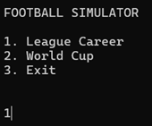

The main menu provides access to the available simulation modes and allows the user to begin or continue a simulation.

### Simulation Setup

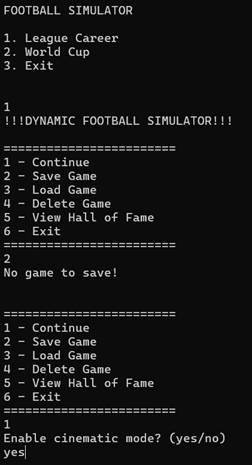

The simulation setup allows the user to configure how the simulation will run before starting the competition.
Cinematic mode allows brief pauses between matches so the user can follow each match individually.
The option save game does also not work at the start since there's no simulation to save.

### League in Progress

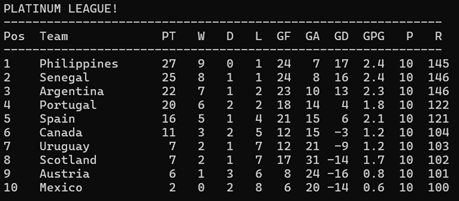

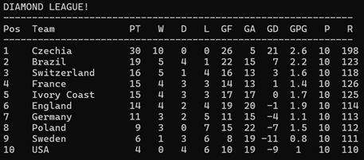

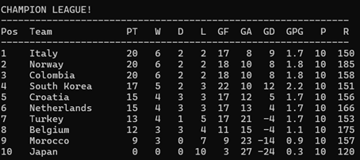

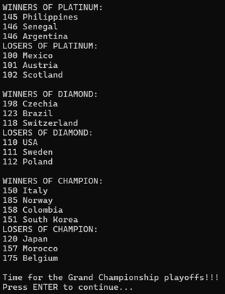

This example shows all three leagues during an active simulation, including team positions, ratings and match statistics.
Promoted and relegated teams shown after all leagues have finished their season.

### Match + DUMM Prediction

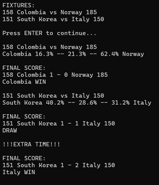

Before a match is simulated, the `MatchPredictor` uses DUMM to estimate the probability of each possible outcome.
The actual match is then simulated separately, meaning the final result can differ from the prediction.

### World Cup

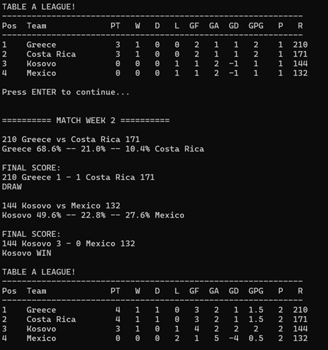

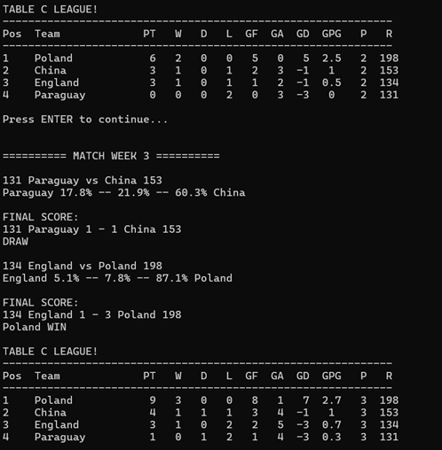

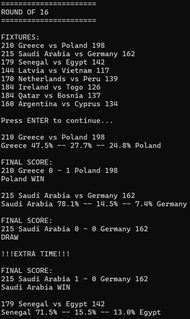

This example demonstrates the World Cup simulation, showing the tournament progressing through its competition structure.

### Save / Load System

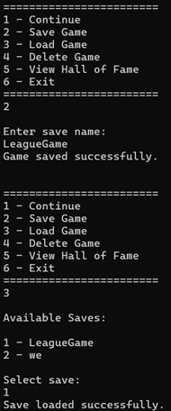

The save and load system allows the user to manage previously saved simulations and continue their progress from a previous session.

## Getting Started

### Requirements

* **Java 17 or later**

### Running the Simulator

Download the latest `DynamicFootballSimulator-1.0.jar` from the GitHub repository.
Or download the latest version using the link:
[**Download Dynamic Football Simulator v1.0**](https://github.com/Jabba1xy/Dynamic-Football-Simulator/releases/latest)

Open a terminal in the folder containing the JAR and run:

```bash
java -jar DynamicFootballSimulator-1.0.jar
```

The simulator will start in the terminal and guide the user through the available simulation modes and settings.

## What I Learned

This project started as a simple idea: I wanted to simulate a football match because I thought it would be fun.
I already had some Java experience from Minecraft modding, but I wanted to use that knowledge to build something of my own.

The project initially used fixed team ratings and a basic match outcome system. After seeing that the results became too predictable,
I wanted to make the simulation more dynamic. This led to the development of the **Dynamic Uncertainty Match Model (DUMM)** and, later, the **Dynamic Rating Equation (DRE)**.

As the project evolved, I gradually introduced more features including match predictions, additional statistics, more teams,
league systems, persistence and eventually a full World Cup simulation.

### Java & Programming Concepts

Through developing the project, I gained a much deeper understanding of Java, including:

* **Generics** — I developed a practical understanding of how generics can be used to create reusable and type-safe classes, particularly within the save system.
* **Collections and data structures** — including `List`, `ArrayList`, arrays, `Deque` and `ArrayDeque`.
* **Records** — using records for immutable data structures such as DTOs and saved data.
* **Enums** — representing fixed states such as simulation types, match outcomes, league tiers and knockout rounds.
* **JSON and persistence** — using Jackson to serialise and deserialize application data and designing a system that can save and restore simulations.
* **Gradle and dependencies** — gaining experience with build automation, dependency management and creating an executable JAR.

### Object-Oriented Design

One of the biggest areas of learning was understanding how to structure an object-oriented application properly.

The project originally contained a large amount of logic in a single `Main` class. As the project grew,
I learned how to identify responsibilities and move them into appropriate classes.

This led to a much more structured architecture with separate areas for:

* Domain models
* Services and simulation logic
* Persistence and data mapping
* User-interface functionality
* Configuration
* Simulation modes

I also developed a better understanding of **encapsulation, separation of responsibilities, dependency injection and refactoring**.
Rather than simply making the program work, I learned the importance of making the code readable, maintainable and easier to test.

### Testing & Debugging

I learned how to use **JUnit 5** and **Mockito** to test individual components and verify that changes did not break existing functionality.
Writing these tests also helped me understand the importance of designing classes with testing in mind.

### Problem-Solving & Iterative Development

A large part of the project was developed through experimentation and problem-solving.

When something did not produce the behaviour I wanted, I investigated why, changed the design and tested the result again.
The DRE in particular was developed incrementally, with different factors being introduced to make team ratings better represent performance.

This taught me that software development is not always about designing everything perfectly from the beginning.
It is often about building something, identifying problems, learning from them and improving the design.

### Overall

The biggest lesson from this project has been the difference between **writing code that works and writing software that is well-structured**.

I enjoyed seeing the project evolve from a small experiment with a messy `Main` class into a much larger,
organised application with multiple simulation modes, dynamic systems, persistence and automated testing.

The project has evolved through my **curiosity and passion for programming**, and building it has given me a much stronger understanding of Java,
object-oriented design, testing and software development as a whole.

## Future Improvements

If development continues, I would like to expand the simulator with several new features:

* **More Teams** — Add more teams and countries to increase the variety and scale of the simulations.
* **More Leagues** — Introduce additional league systems and competition structures.
* **New Game Mode** — Develop another simulation mode with a different competition format and gameplay structure.
* **Graphical User Interface** — Replace or complement the current console interface with a GUI to make the simulator more interactive and accessible to users.
* **Further Simulation Features** — Continue expanding the simulation systems, statistics and team progression as new ideas are developed.

## Author

**Jamie Scott**

- **GitHub:** [Jamie Scott](https://github.com/Jabba1xy)

Java | Gradle | JUnit 5
